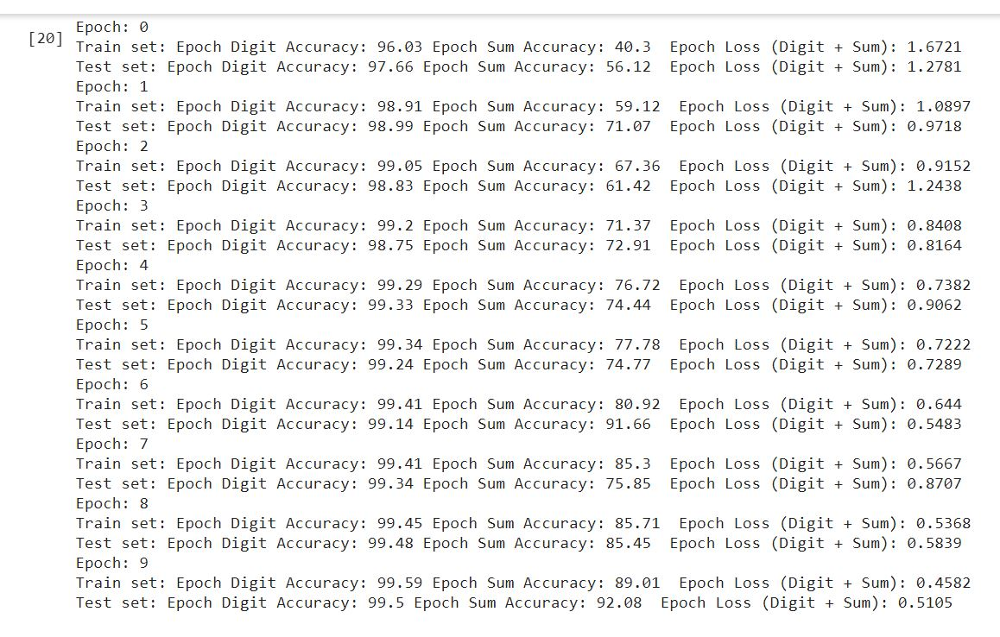
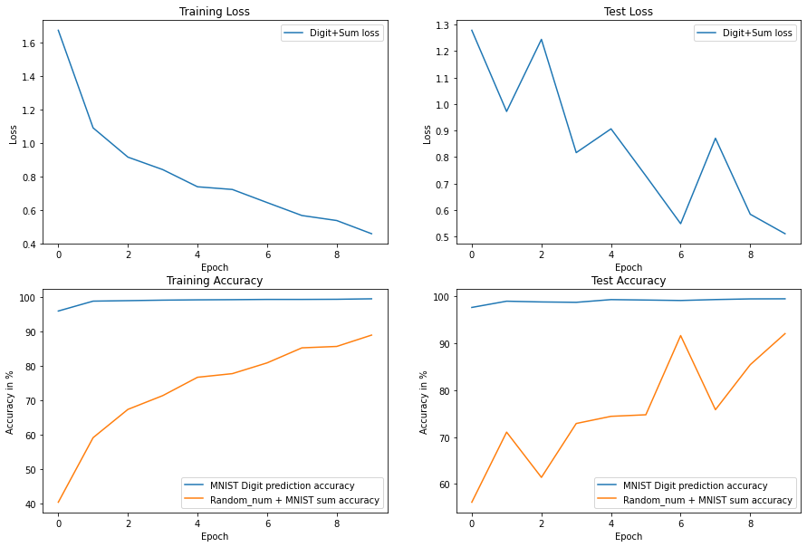

# Pytorch

Objective of this project is to train a neural network to take in two inputs- an image from MNIST dataset and a random number between 0 and 9 and return the number represented by the MNIST image and sum of the this MNIST's number with the input random number.

### Model Hyperparameters

* Optimizer: SGD
* Loss function: Cross Entropy loss (MNIST digit recognition) + Cross Entropy loss (Sum recognition)
* Batch Size: 128
* Epochs: 10

### 

**Data Representation** - Input image and the generated random number is represented as a tensor and fed to the network. The random number tensor is converted into embedding with dictionary size as 10 (random number ranges from 0 to 9) inside the model. 

**Data Generation Strategy** - Custom dataset class provides a dictionary of MNIST image, image's label, a random number and the sum of the image's label and the random number. 

**Input combination method** - Within the model, fully convolutional layers are used to extract channels from MNIST image for classification. Random number's embedding is passed through fully connected layer and elementwise summed with convolutional output. Result is passed through a fully connected layer to receive 19 dimension result to claissify the result of the summation (summation result ranges from 0 to 18).

**Loss function** - Cross Entropy loss is used for image classification case. Considering summation to be classification problem, Cross entropy loss is taken for predicting sum of MNIST number and random number. Overall loss is the sum of these two cross entropy losses.

**Result Evaluation** - Accuracy is calculated for the correct predictions for both image and summation classification. Test accuracy for image classification is 99.5% and for summation classification is 90%.

### Results

#### Training logs

#### Loss/Accuracy trend

