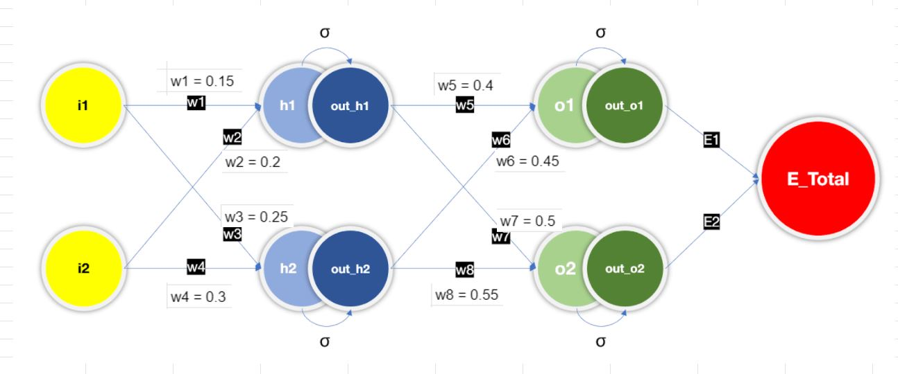
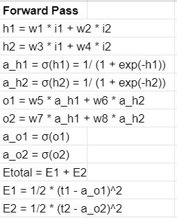
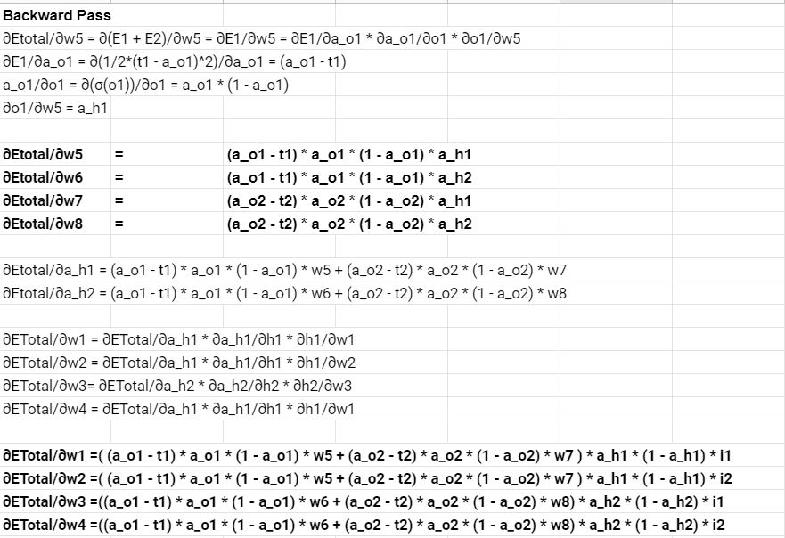
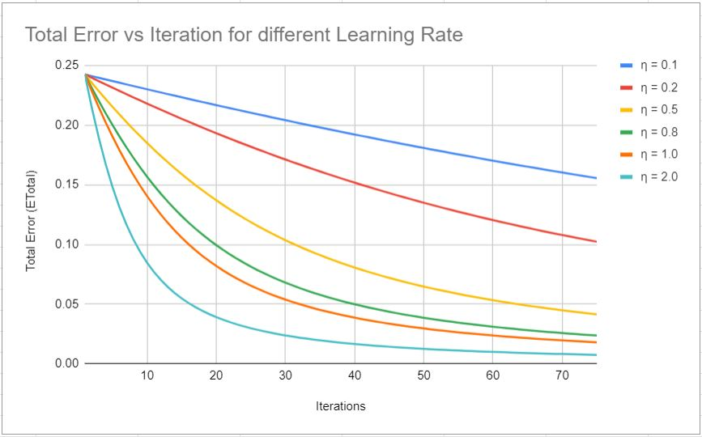
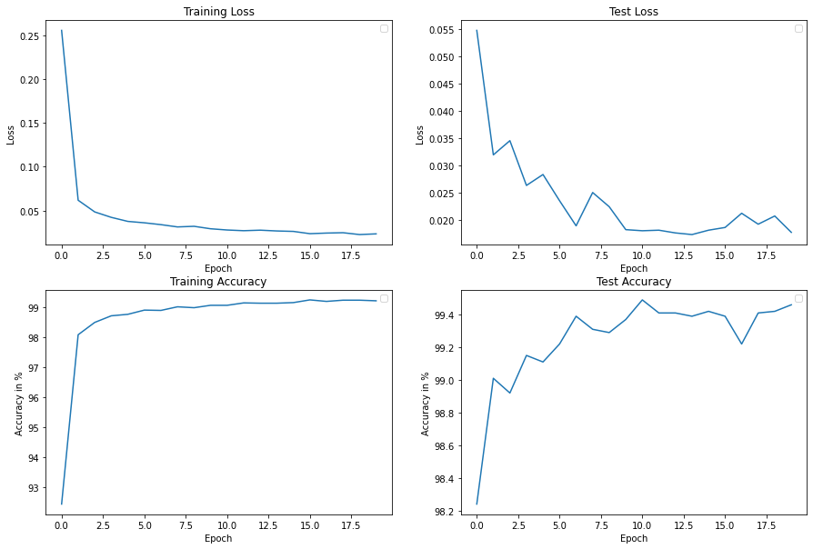

# Back propogation and Architectural Basics

## Objective - Part A

Objective of this activity is to design a 2 layer fully connected network with forward pass, Loss calculation, gradient calculation and backward pass.

Shared above is a fully connected layer with 2 inputs (i1 and i2) and has 2 hidden layer (h1-2 and o1-2). Weights (w1, w2, w3 and w4) are weights for the first hidden layer and (w5, w6, w7 and w8) are for the second hidden layer. Sigmoid function is used as the activation function for the hidden layers. Error is calculated by taking the Square of the difference of expected (t1, t2) and actual values (a_o1, a_o2). ETotal is the total error calculated for the forward pass and is the sum of the errors of each branch (E1 and E2).

The objective of the forward and backward pass calculation is to adjust all the weights of the model in such a way that the total error of the model is at its lowest.

### Process

1. Forward Pass

Hidden layer output is calculated by multiplying the inputs with their weights. Activation function-Sigmoid is then applied on the hidden layer's output to get the activated output. The same step is followed for the second hidden layer.

Error for the branch is calculated by taking the square of the difference of expected output and the actual output. Total error for the network is the sum of the errors of the two branches.

2. Backward pass

During backward pass, the contribution towards the total error by each weight is calculated (dE/dw8, dE/dw7..). Backward pass calculation starts from the right in the neural network (layer near total error)and the contribution from all the subsequent weights is calculated using chain rule.

The weights of the neural network are then updated by taking the difference of the weight with product of the delta calculate above and learning rate. Learning rate decides how much the weights can change on each update.

### Results

Shared below is the trend of the Total Error over iterations for different learning rates. In this case, higher learning rate has given the steepest curve.

## Objective - Part B

Objective is to design a fully convolutional neural network for image classification on MNIST dataset to achieve test accuracy of 99.4% with model's total parameter less than 20K.

### Model's hyper parameters

### Test Results

