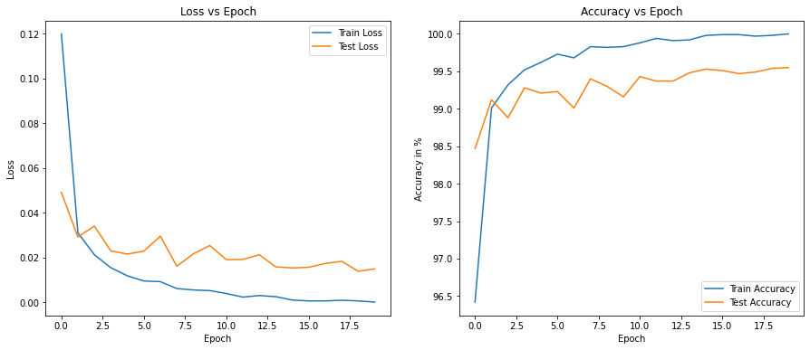
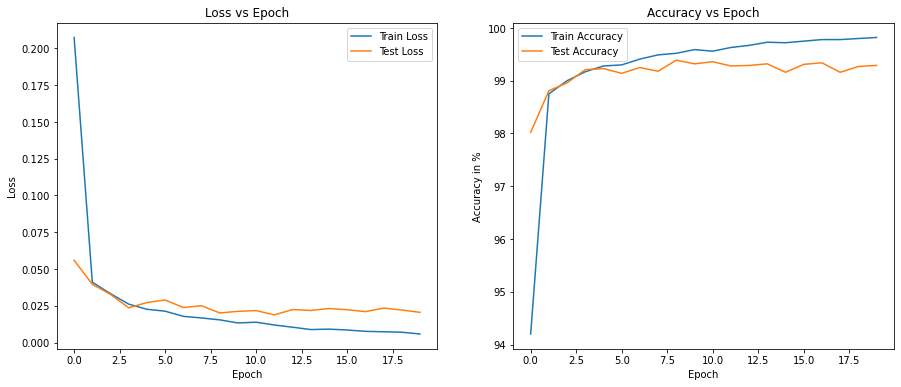
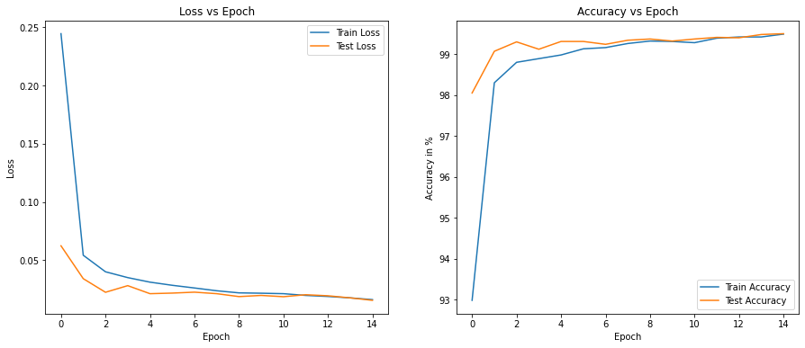
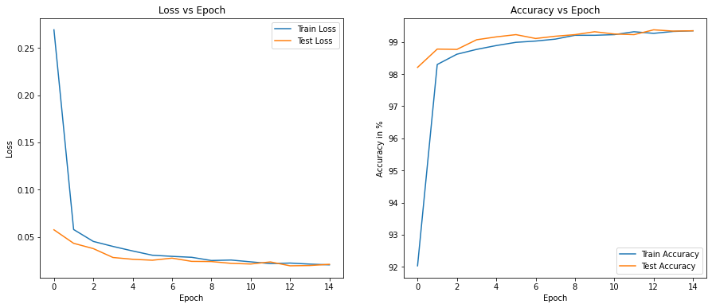
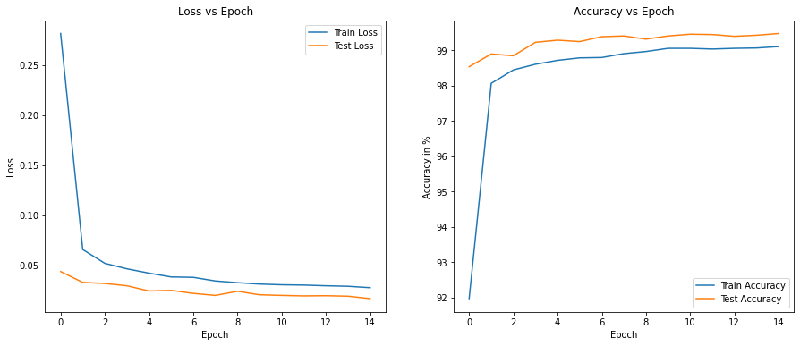

# Coding Drill Down

Objective of the assignment is to document steps from setting up initial model with training structure to a lean model with less than 8K model parameter size that can achieve atleast 99.4% test accuracy on MNIST dataset.

## Code 1

### Target:
1. Setup structure for MNIST image classification. Setup of dataset preparation, data transformation, dataloader, first CNN model, train and test loops.

### Results:
1. This is one of the models prepared for the initial assignment. Model size is 1.175 M parameters.
2. Training accuracy of 99.98% and test accuracy of 99.5%

### Analysis:
1. Over 1 million parameters for the model makes it quite heavy.
2. Training accuracy is higher than test accuracy in this case, indicating over-fitting.

### Model Summary

```
----------------------------------------------------------------
        Layer (type)               Output Shape         Param #
================================================================
            Conv2d-1           [-1, 32, 28, 28]             288
       BatchNorm2d-2           [-1, 32, 28, 28]              64
              ReLU-3           [-1, 32, 28, 28]               0
            Conv2d-4           [-1, 32, 28, 28]           9,216
       BatchNorm2d-5           [-1, 32, 28, 28]              64
              ReLU-6           [-1, 32, 28, 28]               0
         MaxPool2d-7           [-1, 32, 14, 14]               0
            Conv2d-8           [-1, 64, 14, 14]          18,432
       BatchNorm2d-9           [-1, 64, 14, 14]             128
             ReLU-10           [-1, 64, 14, 14]               0
           Conv2d-11           [-1, 64, 14, 14]          36,864
      BatchNorm2d-12           [-1, 64, 14, 14]             128
             ReLU-13           [-1, 64, 14, 14]               0
        MaxPool2d-14             [-1, 64, 7, 7]               0
           Conv2d-15            [-1, 128, 7, 7]          73,728
      BatchNorm2d-16            [-1, 128, 7, 7]             256
             ReLU-17            [-1, 128, 7, 7]               0
           Conv2d-18            [-1, 128, 7, 7]         147,456
      BatchNorm2d-19            [-1, 128, 7, 7]             256
             ReLU-20            [-1, 128, 7, 7]               0
           Conv2d-21            [-1, 256, 7, 7]         294,912
      BatchNorm2d-22            [-1, 256, 7, 7]             512
             ReLU-23            [-1, 256, 7, 7]               0
           Conv2d-24            [-1, 256, 7, 7]         589,824
      BatchNorm2d-25            [-1, 256, 7, 7]             512
             ReLU-26            [-1, 256, 7, 7]               0
        AvgPool2d-27            [-1, 256, 1, 1]               0
           Conv2d-28             [-1, 10, 1, 1]           2,560
================================================================
Total params: 1,175,200
Trainable params: 1,175,200
Non-trainable params: 0
----------------------------------------------------------------
Input size (MB): 0.00
Forward/backward pass size (MB): 2.66
Params size (MB): 4.48
Estimated Total Size (MB): 7.14
----------------------------------------------------------------
```

### Train/Test Loss and accuracy trend versus epochs


## Code 2

### Target:
1. Previous model was quite heavy with 1.175M parameters. Target is to reduce the number of parameters and make the model lighter.

### Results:
1. Convolution with large channels (128, 256 channels) has been replaced as MNIST dataset doesnt warrant usage of them. Model is considerably lighter now with 12K parameters. 
2. Training accuracy of 99.8% and test accuracy of 99.27%

### Analysis:
1. Model is still quite heavy compared to the 8K parameter requirement.
2. Training accuracy is still higher compared to test accuracy indicating over-fitting.

### Model Summary

```
----------------------------------------------------------------
        Layer (type)               Output Shape         Param #
================================================================
            Conv2d-1            [-1, 8, 28, 28]              72
              ReLU-2            [-1, 8, 28, 28]               0
       BatchNorm2d-3            [-1, 8, 28, 28]              16
            Conv2d-4           [-1, 16, 28, 28]           1,152
              ReLU-5           [-1, 16, 28, 28]               0
       BatchNorm2d-6           [-1, 16, 28, 28]              32
            Conv2d-7           [-1, 16, 28, 28]           2,304
              ReLU-8           [-1, 16, 28, 28]               0
       BatchNorm2d-9           [-1, 16, 28, 28]              32
        MaxPool2d-10           [-1, 16, 14, 14]               0
           Conv2d-11            [-1, 8, 14, 14]             128
           Conv2d-12           [-1, 16, 12, 12]           1,152
             ReLU-13           [-1, 16, 12, 12]               0
      BatchNorm2d-14           [-1, 16, 12, 12]              32
           Conv2d-15           [-1, 16, 10, 10]           2,304
             ReLU-16           [-1, 16, 10, 10]               0
      BatchNorm2d-17           [-1, 16, 10, 10]              32
           Conv2d-18             [-1, 16, 8, 8]           2,304
             ReLU-19             [-1, 16, 8, 8]               0
      BatchNorm2d-20             [-1, 16, 8, 8]              32
           Conv2d-21             [-1, 16, 6, 6]           2,304
             ReLU-22             [-1, 16, 6, 6]               0
      BatchNorm2d-23             [-1, 16, 6, 6]              32
        AvgPool2d-24             [-1, 16, 1, 1]               0
           Conv2d-25             [-1, 10, 1, 1]             160
================================================================
Total params: 12,088
Trainable params: 12,088
Non-trainable params: 0
----------------------------------------------------------------
Input size (MB): 0.00
Forward/backward pass size (MB): 0.88
Params size (MB): 0.05
Estimated Total Size (MB): 0.93
----------------------------------------------------------------
```

### Train/Test Loss and accuracy trend versus epochs



## Code 3

### Target:
1. Previous model was showing over-fitting tendency. We will try to reduce the gap between test and train accuracy by regularizing the model with dropouts.

### Results:
1. With dropout of 0.05 added at each layer, overfitting is reduced.
2. Training accuracy of 99.42% and test accuracy of 99.49%

### Analysis:
1. Overfitting tendency which was observed in previous model has been reduced.
2. Model is still quite heavy compared to the 8K parameter requirement. From observation, at RF=5x5 itself useful patterns are formed. Hence, we will remove the 3rd 3x3 conv layer before maxpooling.

### Model Summary

```
----------------------------------------------------------------
        Layer (type)               Output Shape         Param #
================================================================
            Conv2d-1            [-1, 8, 28, 28]              72
              ReLU-2            [-1, 8, 28, 28]               0
       BatchNorm2d-3            [-1, 8, 28, 28]              16
           Dropout-4            [-1, 8, 28, 28]               0
            Conv2d-5           [-1, 16, 28, 28]           1,152
              ReLU-6           [-1, 16, 28, 28]               0
       BatchNorm2d-7           [-1, 16, 28, 28]              32
           Dropout-8           [-1, 16, 28, 28]               0
            Conv2d-9           [-1, 16, 28, 28]           2,304
             ReLU-10           [-1, 16, 28, 28]               0
      BatchNorm2d-11           [-1, 16, 28, 28]              32
          Dropout-12           [-1, 16, 28, 28]               0
        MaxPool2d-13           [-1, 16, 14, 14]               0
           Conv2d-14            [-1, 8, 14, 14]             128
           Conv2d-15           [-1, 16, 12, 12]           1,152
             ReLU-16           [-1, 16, 12, 12]               0
      BatchNorm2d-17           [-1, 16, 12, 12]              32
          Dropout-18           [-1, 16, 12, 12]               0
           Conv2d-19           [-1, 16, 10, 10]           2,304
             ReLU-20           [-1, 16, 10, 10]               0
      BatchNorm2d-21           [-1, 16, 10, 10]              32
          Dropout-22           [-1, 16, 10, 10]               0
           Conv2d-23             [-1, 16, 8, 8]           2,304
             ReLU-24             [-1, 16, 8, 8]               0
      BatchNorm2d-25             [-1, 16, 8, 8]              32
          Dropout-26             [-1, 16, 8, 8]               0
           Conv2d-27             [-1, 16, 6, 6]           2,304
             ReLU-28             [-1, 16, 6, 6]               0
      BatchNorm2d-29             [-1, 16, 6, 6]              32
          Dropout-30             [-1, 16, 6, 6]               0
        AvgPool2d-31             [-1, 16, 1, 1]               0
           Conv2d-32             [-1, 10, 1, 1]             160
================================================================
Total params: 12,088
Trainable params: 12,088
Non-trainable params: 0
----------------------------------------------------------------
Input size (MB): 0.00
Forward/backward pass size (MB): 1.16
Params size (MB): 0.05
Estimated Total Size (MB): 1.21
----------------------------------------------------------------
```

### Train/Test Loss and accuracy trend versus epochs



## Code 4

### Target:
1. Previous model's parameter count was 12K. Useful patterns of the MNIST digits are formed at RF=5x5 itself. Hence, max pooling will be performed at RF 5x5. Also, reduce number of kernels with large channels (16 channels) and add kernels with 12 channels since MNIST has simple edges and less number of classes. 

### Results:
1. Model size has dropped to 7.8K with removal of additional convolutions.
2. Training and test accuracy  is 99.27% and 99.35%. No over-fitting.

### Analysis:
1. Model size is now within our requirements (<8K parameters). 
2. With reduction of model capacity, test accuracy has dropped below 99.4%. Image augmentation can be tried to increase accuracy.

### Model Summary

```
----------------------------------------------------------------
        Layer (type)               Output Shape         Param #
================================================================
            Conv2d-1            [-1, 8, 28, 28]              72
              ReLU-2            [-1, 8, 28, 28]               0
       BatchNorm2d-3            [-1, 8, 28, 28]              16
           Dropout-4            [-1, 8, 28, 28]               0
            Conv2d-5           [-1, 16, 28, 28]           1,152
              ReLU-6           [-1, 16, 28, 28]               0
       BatchNorm2d-7           [-1, 16, 28, 28]              32
           Dropout-8           [-1, 16, 28, 28]               0
         MaxPool2d-9           [-1, 16, 14, 14]               0
           Conv2d-10            [-1, 8, 14, 14]             128
           Conv2d-11           [-1, 12, 12, 12]             864
             ReLU-12           [-1, 12, 12, 12]               0
      BatchNorm2d-13           [-1, 12, 12, 12]              24
          Dropout-14           [-1, 12, 12, 12]               0
           Conv2d-15           [-1, 12, 10, 10]           1,296
             ReLU-16           [-1, 12, 10, 10]               0
      BatchNorm2d-17           [-1, 12, 10, 10]              24
          Dropout-18           [-1, 12, 10, 10]               0
           Conv2d-19             [-1, 16, 8, 8]           1,728
             ReLU-20             [-1, 16, 8, 8]               0
      BatchNorm2d-21             [-1, 16, 8, 8]              32
          Dropout-22             [-1, 16, 8, 8]               0
           Conv2d-23             [-1, 16, 6, 6]           2,304
             ReLU-24             [-1, 16, 6, 6]               0
      BatchNorm2d-25             [-1, 16, 6, 6]              32
          Dropout-26             [-1, 16, 6, 6]               0
        AvgPool2d-27             [-1, 16, 1, 1]               0
           Conv2d-28             [-1, 10, 1, 1]             160
================================================================
Total params: 7,864
Trainable params: 7,864
Non-trainable params: 0
----------------------------------------------------------------
Input size (MB): 0.00
Forward/backward pass size (MB): 0.75
Params size (MB): 0.03
Estimated Total Size (MB): 0.78
----------------------------------------------------------------
```

### Train/Test Loss and accuracy trend versus epochs



## Code 5

### Target:
1. Model's test accuracy is at 99.35%. We will try to check if accuracy can be increased by addition of image augmentation (random rotation of +/- 6.9 degrees).

### Results:
1. Training accuracy is 99.1% while test accuracy is consistently over 99.4% for the last 5 epochs.
2. Model's parameter size is 7.8K.


### Analysis:
1. With image augmentation, results show underfitting which means training is harder. Requirement of test accuracy of 99.4% for last 5 epochs has been achieved.
1. Model size is now within our requirements (<8K parameters). 

### Model Summary

```
----------------------------------------------------------------
        Layer (type)               Output Shape         Param #
================================================================
            Conv2d-1            [-1, 8, 28, 28]              72
              ReLU-2            [-1, 8, 28, 28]               0
       BatchNorm2d-3            [-1, 8, 28, 28]              16
           Dropout-4            [-1, 8, 28, 28]               0
            Conv2d-5           [-1, 16, 28, 28]           1,152
              ReLU-6           [-1, 16, 28, 28]               0
       BatchNorm2d-7           [-1, 16, 28, 28]              32
           Dropout-8           [-1, 16, 28, 28]               0
         MaxPool2d-9           [-1, 16, 14, 14]               0
           Conv2d-10            [-1, 8, 14, 14]             128
           Conv2d-11           [-1, 12, 12, 12]             864
             ReLU-12           [-1, 12, 12, 12]               0
      BatchNorm2d-13           [-1, 12, 12, 12]              24
          Dropout-14           [-1, 12, 12, 12]               0
           Conv2d-15           [-1, 12, 10, 10]           1,296
             ReLU-16           [-1, 12, 10, 10]               0
      BatchNorm2d-17           [-1, 12, 10, 10]              24
          Dropout-18           [-1, 12, 10, 10]               0
           Conv2d-19             [-1, 16, 8, 8]           1,728
             ReLU-20             [-1, 16, 8, 8]               0
      BatchNorm2d-21             [-1, 16, 8, 8]              32
          Dropout-22             [-1, 16, 8, 8]               0
           Conv2d-23             [-1, 16, 6, 6]           2,304
             ReLU-24             [-1, 16, 6, 6]               0
      BatchNorm2d-25             [-1, 16, 6, 6]              32
          Dropout-26             [-1, 16, 6, 6]               0
        AvgPool2d-27             [-1, 16, 1, 1]               0
           Conv2d-28             [-1, 10, 1, 1]             160
================================================================
Total params: 7,864
Trainable params: 7,864
Non-trainable params: 0
----------------------------------------------------------------
Input size (MB): 0.00
Forward/backward pass size (MB): 0.75
Params size (MB): 0.03
Estimated Total Size (MB): 0.78
----------------------------------------------------------------
```

### Train/Test Loss and accuracy trend versus epochs


