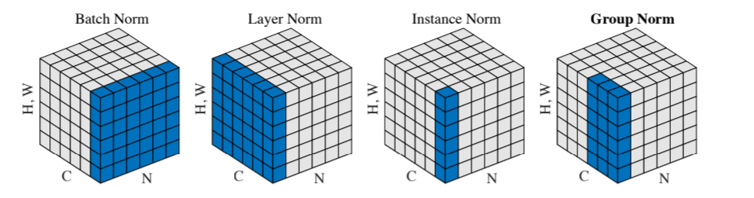
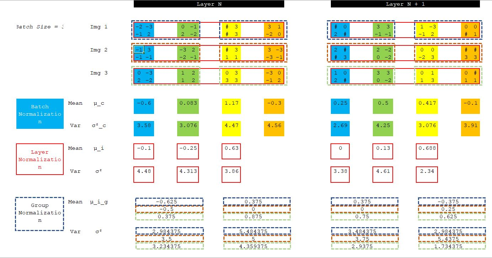
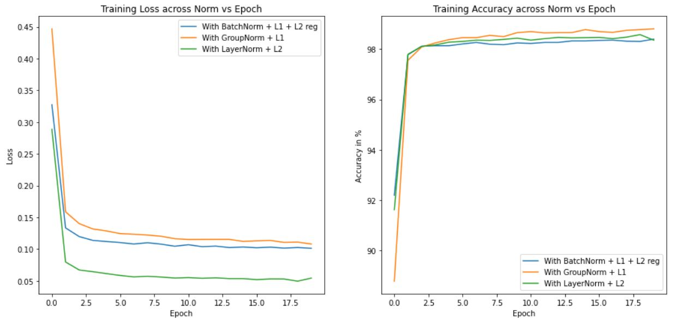
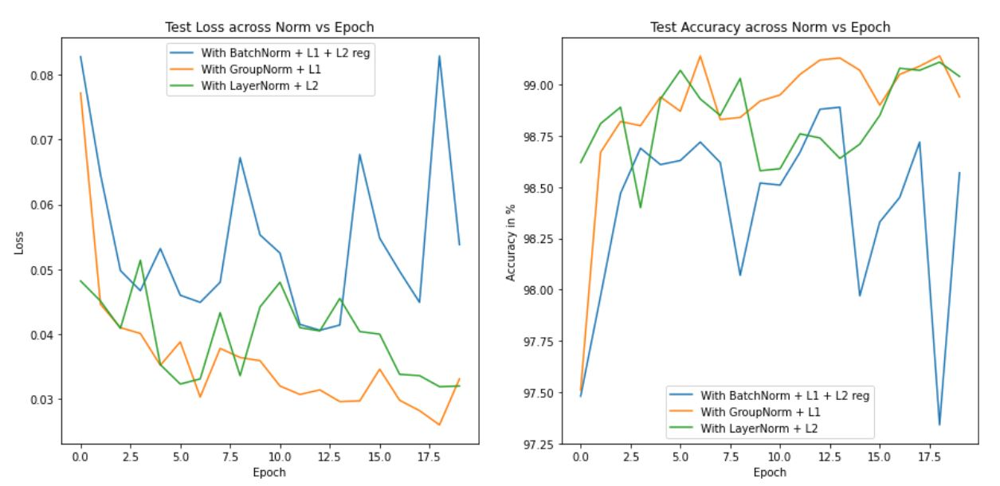
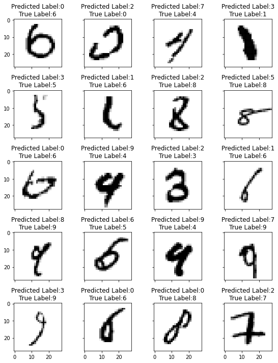
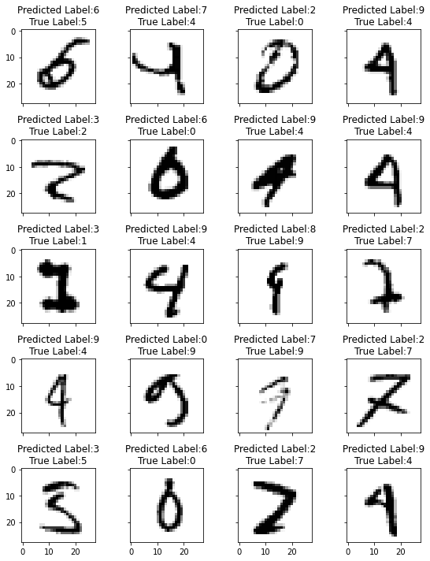
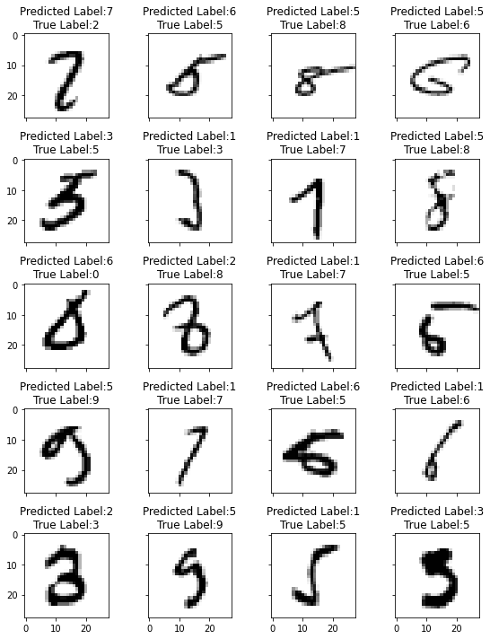

# Normalization and Regularization

The objective of this assignment is to design CNN model for image classification with weight regularization (L1 and L2) and normalization techniques (Batch Norm, Group Norm and Layer Norm) and observe their behaviour.

## Observations

1. Compared to the 3 normalization techniques, training with Group Normalization gave better results with best validation loss of 0.026 (validation accuracy of 99.14%). Combination of weight regularization and Group Norm is recommended for SOTA results.
2. For the considered batch size, Run with Layer Norm gave better results compared to BN. 
3. Fluctuation in loss and accuracy was observed in the run with BN in combination with L1 and L2 reg. L1, L2 parameter tuning may be required. 

## Model Hyperparameters

#### Across models

* Optimizer: SGD
* Loss Function: Cross Entropy Loss
* Learning Rate: 0.04
* Dropout: 0.05
* Batch Size: 128
* Epochs: 20

#### Model 1: Batch Normalization + L1 + L2 regularization

* L1 regularization parameter: 0.0001
* L2 regularization parameter: 0.001 

#### Model 2: Group Normalization + L1 regularization

* L1 regularization parameter: 0.0001
* Group Norm- groups: 0.5 * channels

#### Model 3: Layer Normalization + L2 regularization

* L2 regularization parameter: 0.001
* Layer Norm- groups: 1

## Normalization techniques

Normalization is a technique for training very deep neural networks that standardizes the inputs to a layer for each mini-batch. It has effect of stabilizing the learning process and dramatically reducing the number of training epochs required to train deep networks.

[Image Source](https://amaarora.github.io/2020/08/09/groupnorm.html)

Shared above is a batch of input images of dimension NxCxHxW that needs to be normalized. Here, N is the batch size, C is the number of channels, H and W is the height and width of the feature maps.

In **Batch Normalization**, all the pixels having the same channel index are normalized together. For each channel, Batch Norm computes the mean and standard deviation along the (N, H, W) axes. For example, if a layer has 32 channels for Batch Norm, 32 mean and 32 standard deviations would be calculated.

In **Group Normalization**, the batch is divided into groups. So, batch with dimension- NxCxHxW is reshaped to NxGxC//GxHxW dimensions, G is the number of groups. Then mean and standard deviation is calculated along HxW and C//G. For example, if a layer has 32 channels for Group Norm with G=8 as the number of groups, then 8 mean and 8 standard deviation are calculated.

In **Layer Normalization**, mean and std deviation are computed for each sample along the CxHxW axes. Calculation is independent of Batch size. For example, if a layer has 32 channels for Layer Norm, then 32 would be the number of groups and only 1 mean and 1 standard deviation are calculated.

## Code structure

BatchNorm, GroupNorm and LayerNorm are implemented in the model and is instantiated by passing the normalization name string as argument. 

L1 weight regularization is implemented in train function while L2 regularization is set by passing weight decay parameter during Optimizer instantation.

## Results

### Training loss/accuracy trend across normalization vs epochs

### Test loss/accuracy trend across normalization vs epochs

### Missclassified Images

Below are the list of missclassifed images with their correct and predicted labels foe each of the run.

#### Model 1: Batch Normalization + L1 + L2 regularization

#### Model 2: Group Normalization + L1 regularization

#### Model 3: Batch Normalization + L2 regularization

