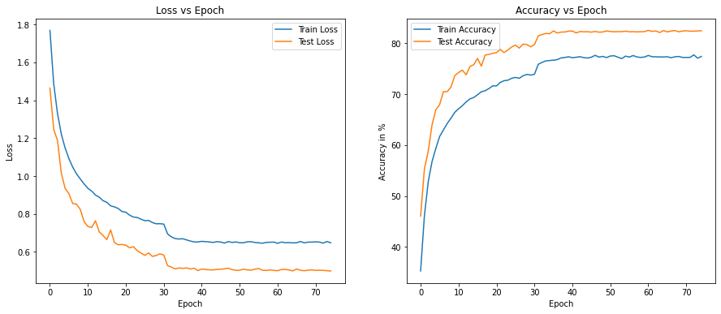
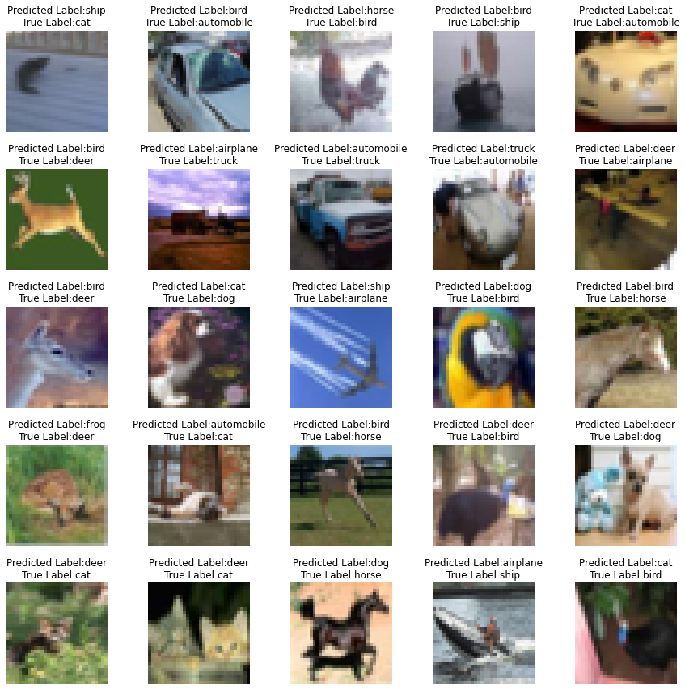

# Advanced Concepts

The objective of this assignment is to design a CNN model for image classification on CIFAR10 dataset. 

The CNN model uses the following convolutional concepts-
1. Dilated convolution with strides has been used instead of MaxPooling to downsample spatial dimension (height and width).
2. Depthwise Seperable convolution to use more channels at lower parameter cost
3. Dilated convolution in one of the layers to increase the receptive field which enables to capture the global view of the images.

Image transformations from Albumentation library is also used to provide means of regularization. 

## Model Hyperparameters

* Optimizer: SGD
* Loss Function: Cross Entropy Loss
* Learning Rate: 0.04
* Batch Size: 128
* Epochs: 75

Scheduler - ReduceLROnPlateau

* factor=0.1
* patience=2
* threshold=0.001

## Model Summary

```
----------------------------------------------------------------
        Layer (type)               Output Shape         Param #
================================================================
            Conv2d-1            [-1, 3, 32, 32]              81
              ReLU-2            [-1, 3, 32, 32]               0
       BatchNorm2d-3            [-1, 3, 32, 32]               6
            Conv2d-4            [-1, 3, 32, 32]              27
            Conv2d-5           [-1, 64, 32, 32]             192
              ReLU-6           [-1, 64, 32, 32]               0
       BatchNorm2d-7           [-1, 64, 32, 32]             128
            Conv2d-8            [-1, 3, 32, 32]              81
              ReLU-9            [-1, 3, 32, 32]               0
      BatchNorm2d-10            [-1, 3, 32, 32]               6
           Conv2d-11           [-1, 64, 32, 32]           4,288
             ReLU-12           [-1, 64, 32, 32]               0
      BatchNorm2d-13           [-1, 64, 32, 32]             128
           Conv2d-14           [-1, 64, 32, 32]             192
      BatchNorm2d-15           [-1, 64, 32, 32]             128
       BasicBlock-16           [-1, 64, 32, 32]               0
           Conv2d-17           [-1, 32, 32, 32]           2,048
           Conv2d-18           [-1, 32, 16, 16]           9,216
             ReLU-19           [-1, 32, 16, 16]               0
      BatchNorm2d-20           [-1, 32, 16, 16]              64
           Conv2d-21           [-1, 32, 16, 16]           9,216
             ReLU-22           [-1, 32, 16, 16]               0
      BatchNorm2d-23           [-1, 32, 16, 16]              64
           Conv2d-24           [-1, 32, 16, 16]             288
           Conv2d-25           [-1, 64, 16, 16]           2,048
             ReLU-26           [-1, 64, 16, 16]               0
      BatchNorm2d-27           [-1, 64, 16, 16]             128
           Conv2d-28           [-1, 64, 16, 16]           2,048
      BatchNorm2d-29           [-1, 64, 16, 16]             128
       BasicBlock-30           [-1, 64, 16, 16]               0
           Conv2d-31           [-1, 32, 16, 16]           2,048
           Conv2d-32             [-1, 32, 8, 8]           9,216
             ReLU-33             [-1, 32, 8, 8]               0
      BatchNorm2d-34             [-1, 32, 8, 8]              64
           Conv2d-35             [-1, 32, 8, 8]           9,216
             ReLU-36             [-1, 32, 8, 8]               0
      BatchNorm2d-37             [-1, 32, 8, 8]              64
           Conv2d-38             [-1, 32, 8, 8]             288
           Conv2d-39             [-1, 64, 8, 8]           2,048
             ReLU-40             [-1, 64, 8, 8]               0
      BatchNorm2d-41             [-1, 64, 8, 8]             128
           Conv2d-42             [-1, 64, 8, 8]           2,048
      BatchNorm2d-43             [-1, 64, 8, 8]             128
       BasicBlock-44             [-1, 64, 8, 8]               0
           Conv2d-45             [-1, 32, 8, 8]           2,048
           Conv2d-46             [-1, 32, 8, 8]           9,216
             ReLU-47             [-1, 32, 8, 8]               0
      BatchNorm2d-48             [-1, 32, 8, 8]              64
           Conv2d-49             [-1, 72, 8, 8]          20,736
             ReLU-50             [-1, 72, 8, 8]               0
      BatchNorm2d-51             [-1, 72, 8, 8]             144
           Conv2d-52             [-1, 10, 8, 8]           6,480
             ReLU-53             [-1, 10, 8, 8]               0
      BatchNorm2d-54             [-1, 10, 8, 8]              20
AdaptiveAvgPool2d-55             [-1, 10, 1, 1]               0
================================================================
Total params: 94,461
Trainable params: 94,461
Non-trainable params: 0
----------------------------------------------------------------
Input size (MB): 0.01
Forward/backward pass size (MB): 6.64
Params size (MB): 0.36
Estimated Total Size (MB): 7.02
----------------------------------------------------------------
```

## Receptive Field Calculation

| Convolution Layer   | Convolution Type    | Kernel | Padding | Stride | Jin | Input Channel | Output Channel | Receptive Field | Jout |
|---------------------|---------------------|--------|---------|--------|-----|---------------|----------------|-----------------|------|
|                     |                     |        |         |        |     |               |                |               1 |      |
| conv_depth_dilated0 | Normal Conv         |      3 |       1 |      1 |   1 |            32 |             32 |               3 |    1 |
|                     | Depthwise           |      3 |       1 |      1 |   1 |            32 |             32 |               5 |    1 |
|                     | Dilated             |      5 |       2 |      1 |   1 |            32 |             32 |               9 |    1 |
| dilationblock1      | Dilated with stride |      5 |       2 |      2 |   1 |            32 |             16 |              13 |    2 |
| conv_depth_dilated1 | Normal Conv         |      3 |       1 |      1 |   2 |            16 |             16 |              17 |    2 |
|                     | Depthwise           |      3 |       1 |      1 |   2 |            16 |             16 |              21 |    2 |
| dilationblock2      | Dilated with stride |      5 |       2 |      2 |   2 |            16 |              8 |              29 |    4 |
| conv_depth_dilated2 | Normal Conv         |      3 |       1 |      1 |   4 |             8 |              8 |              37 |    4 |
|                     | Depthwise           |      3 |       1 |      1 |   4 |             8 |              8 |              45 |    4 |
| dilationblock3      | Dilated |      5 |       2 |      1 |   4 |             8 |              8 |              61 |    4 |
| convblock4          | Normal Conv         |      3 |       1 |      1 |   4 |             8 |              8 |              69 |    4 |
|                     | Normal Conv         |      3 |       1 |      1 |   4 |             8 |              8 |              77 |    4 |
## Results

### Training loss/accuracy trend across normalization vs epochs



### Misclassified Images

Below are the list of missclassifed images with their correct and predicted labels.


