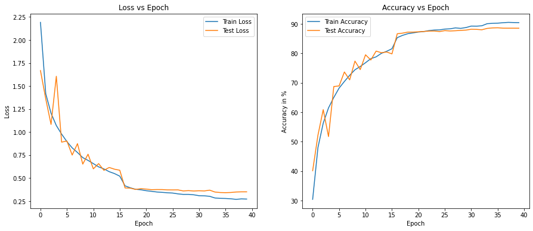
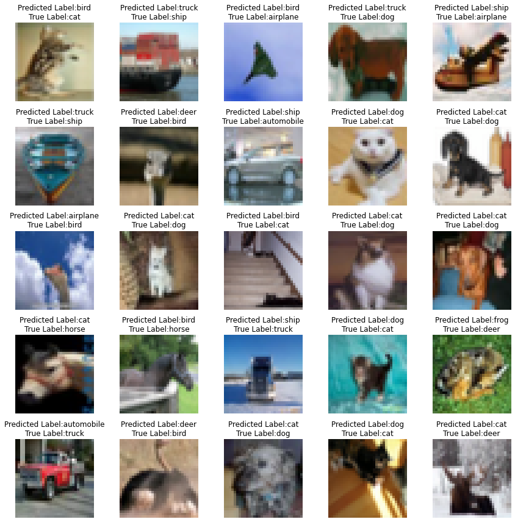
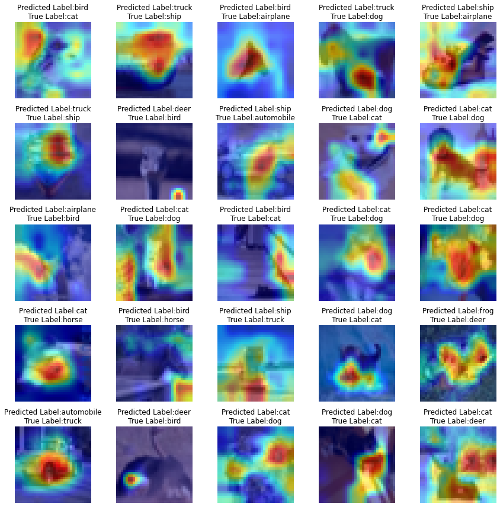
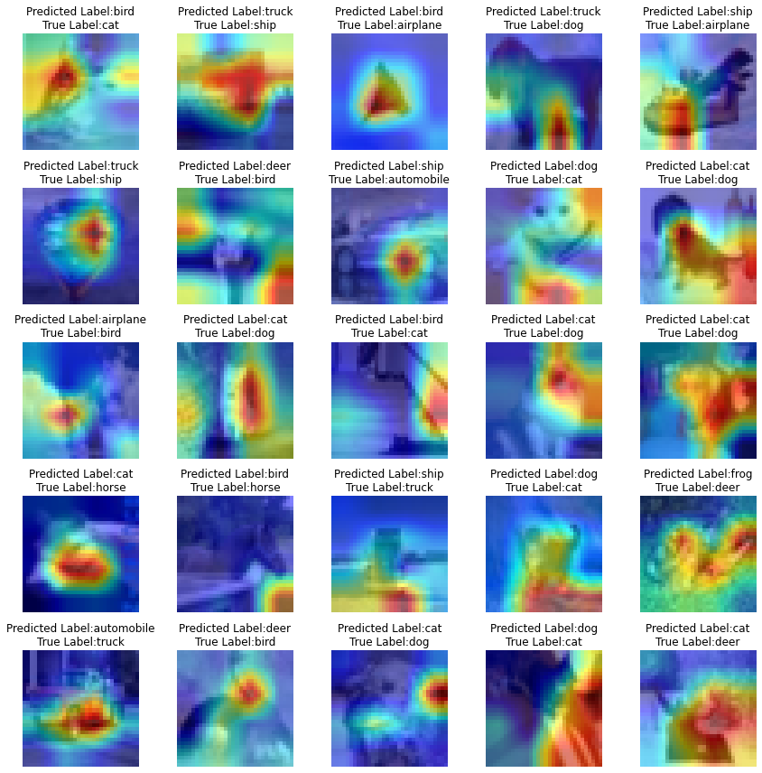

# Advanced Training Concepts

The objective of the assignment is to train image classification model on Cifar10 dataset. The following points have been taken for the model training-

1. Resnet-18 model with Layer Normalization.
2. Image augmentation concepts such as Padding and Random Crop, Rotate and Cut-out
3. ReduceLROnPlateau - Learning rate scheduler to reduce LR when loss (or such metric) has stopped improving.
4. GradCAM- Class activation mapping on misclassified images to understand important regions in the image for predicting the concept.

## Model Hyperparameters

* Optimizer: SGD
* Loss Function: Cross Entropy Loss
* Learning Rate: 0.03
* Batch Size: 128
* Epochs: 40

Scheduler - ReduceLROnPlateau
* factor=0.1
* patience=2
* threshold=0.001

## Model Summary

```
----------------------------------------------------------------
        Layer (type)               Output Shape         Param #
================================================================
            Conv2d-1           [-1, 64, 32, 32]           1,728
         GroupNorm-2           [-1, 64, 32, 32]             128
            Conv2d-3           [-1, 64, 32, 32]          36,864
         GroupNorm-4           [-1, 64, 32, 32]             128
            Conv2d-5           [-1, 64, 32, 32]          36,864
         GroupNorm-6           [-1, 64, 32, 32]             128
        BasicBlock-7           [-1, 64, 32, 32]               0
            Conv2d-8           [-1, 64, 32, 32]          36,864
         GroupNorm-9           [-1, 64, 32, 32]             128
           Conv2d-10           [-1, 64, 32, 32]          36,864
        GroupNorm-11           [-1, 64, 32, 32]             128
       BasicBlock-12           [-1, 64, 32, 32]               0
           Conv2d-13          [-1, 128, 16, 16]          73,728
        GroupNorm-14          [-1, 128, 16, 16]             256
           Conv2d-15          [-1, 128, 16, 16]         147,456
        GroupNorm-16          [-1, 128, 16, 16]             256
           Conv2d-17          [-1, 128, 16, 16]           8,192
      BatchNorm2d-18          [-1, 128, 16, 16]             256
       BasicBlock-19          [-1, 128, 16, 16]               0
           Conv2d-20          [-1, 128, 16, 16]         147,456
        GroupNorm-21          [-1, 128, 16, 16]             256
           Conv2d-22          [-1, 128, 16, 16]         147,456
        GroupNorm-23          [-1, 128, 16, 16]             256
       BasicBlock-24          [-1, 128, 16, 16]               0
           Conv2d-25            [-1, 256, 8, 8]         294,912
        GroupNorm-26            [-1, 256, 8, 8]             512
           Conv2d-27            [-1, 256, 8, 8]         589,824
        GroupNorm-28            [-1, 256, 8, 8]             512
           Conv2d-29            [-1, 256, 8, 8]          32,768
      BatchNorm2d-30            [-1, 256, 8, 8]             512
       BasicBlock-31            [-1, 256, 8, 8]               0
           Conv2d-32            [-1, 256, 8, 8]         589,824
        GroupNorm-33            [-1, 256, 8, 8]             512
           Conv2d-34            [-1, 256, 8, 8]         589,824
        GroupNorm-35            [-1, 256, 8, 8]             512
       BasicBlock-36            [-1, 256, 8, 8]               0
           Conv2d-37            [-1, 512, 4, 4]       1,179,648
        GroupNorm-38            [-1, 512, 4, 4]           1,024
           Conv2d-39            [-1, 512, 4, 4]       2,359,296
        GroupNorm-40            [-1, 512, 4, 4]           1,024
           Conv2d-41            [-1, 512, 4, 4]         131,072
      BatchNorm2d-42            [-1, 512, 4, 4]           1,024
       BasicBlock-43            [-1, 512, 4, 4]               0
           Conv2d-44            [-1, 512, 4, 4]       2,359,296
        GroupNorm-45            [-1, 512, 4, 4]           1,024
           Conv2d-46            [-1, 512, 4, 4]       2,359,296
        GroupNorm-47            [-1, 512, 4, 4]           1,024
       BasicBlock-48            [-1, 512, 4, 4]               0
           Linear-49                   [-1, 10]           5,130
================================================================
Total params: 11,173,962
Trainable params: 11,173,962
Non-trainable params: 0
----------------------------------------------------------------
Input size (MB): 0.01
Forward/backward pass size (MB): 11.25
Params size (MB): 42.63
Estimated Total Size (MB): 53.89
----------------------------------------------------------------

```

## Results

### Training loss/accuracy trend across normalization vs epochs



### Misclassified Images

Below are the list of missclassifed images with their correct and predicted labels.



### GradCAM on misclassified images

Below is the class activation mapping for misclassified images. The activation generated is with respect to the class predicted by the model.

#### Resnet-18 Layer 3




#### Resnet-18 Layer 4


